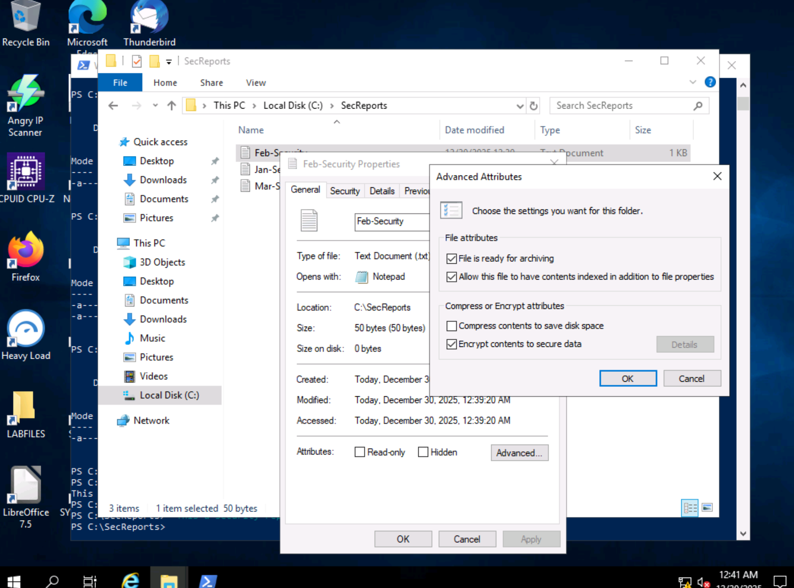
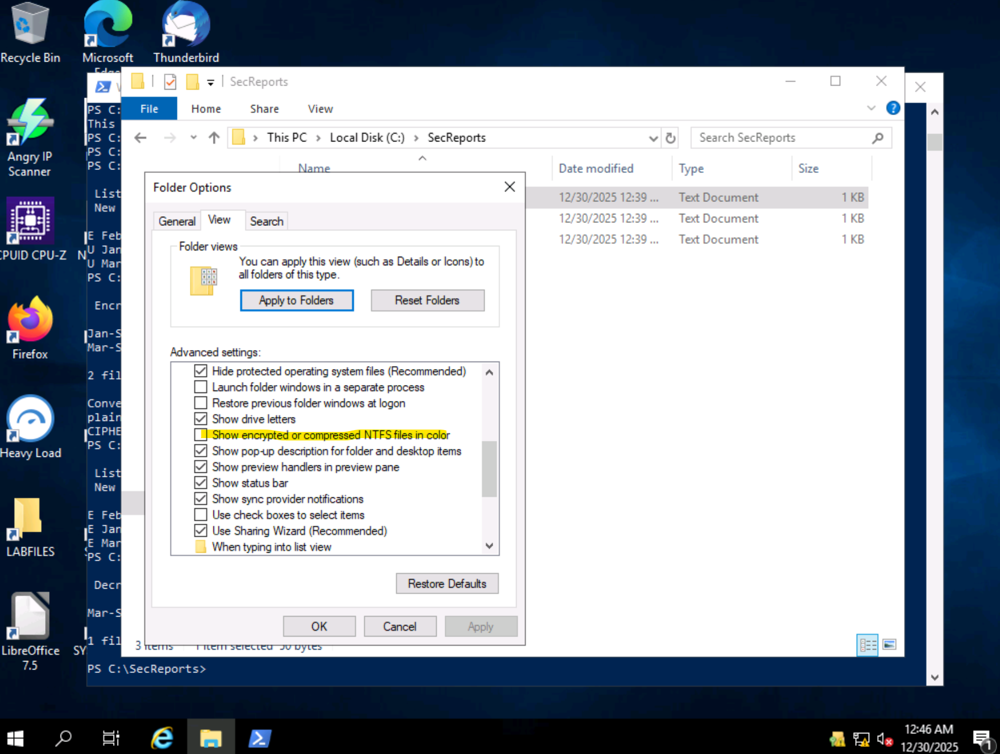

# 1. Storage Encryption
- Encryption File System(EFS), Data Recovery Agent(DRA) / Key Recovery Agent(KRA) **legacy name > no ability to recover the key**
- Data Recovery Agent (DRA) must already be set up **before any files are encrypted.**
- **EFS can be used as a means by which individual users can limit access to files and folders without the need to configure access control settings on those files and folders.**
- When an administrator changes the password of a local user account, the EFS private key of that user account is discarded. Therefore, an administrator **cannot use a password change as a means** to access the encrypted files of a user. However, this does mean the user **loses their ability to access the EFS encrypted files as well.**
```powershell
Remove-Computer -UnjoinDomaincredential Administrator -Restart -Force

//User
cipher
cipher /e *-Security.txt
cipher /d Mar-Security.txt

//Admin
net user Pat Password123
cipher /d Jan-Security.txt //Error
cipher /c Jan-Security.txt //No Key

```





# 2. Hashing and Salting
- http://dftt.sourceforge.net/, https://metadefender.com/
30e7f792cc853e34e17335b243605d3a
- guess by length
| Algorithm | Bit length | Hex length |
|----------|------------|------------|
| MD5      | 128        | 32         |
| SHA-1    | 160        | 40         |
| SHA-224  | 224        | 56         |
| SHA-256  | 256        | 64         |
| SHA-384  | 384        | 96         |
| SHA-512  | 512        | 128        |
- **However, many sites and services still use MD5 in spite of this**
- John should crack the salted password hash in less than 10 seconds. The full Linux hash statement is present in the salted-hash.txt file. Therefore, **John is provided the salt value, which allows it to quickly crack the password.**
- What is the benefit of performing a malware evaluation via a hash value rather than uploading a file? > **Not disclosing the suspect file publicly**

```shell
md5sum 4-kwsrch-ext3/ext3-img-kw-1.dd >> 4-kwsrch-ext3-hash.txt

Get-FileHash -Path "C:\path\to\your\file.exe" -Algorithm SHA1

openssl passwd -salt "" pass1 > hash.txt
openssl passwd -salt SALT pass1 > salted-hash.txt
cat salted-hash.txt | sed "s/SALT//g" > salt-secret-hash.txt
john --incremental hash.txt
```