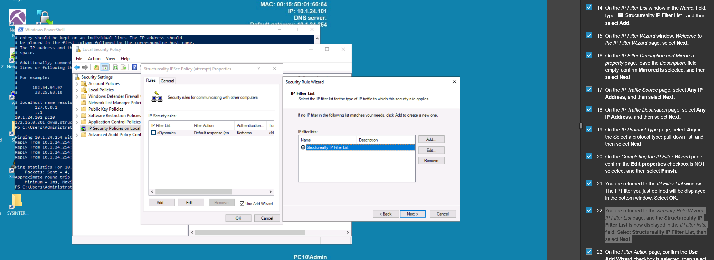
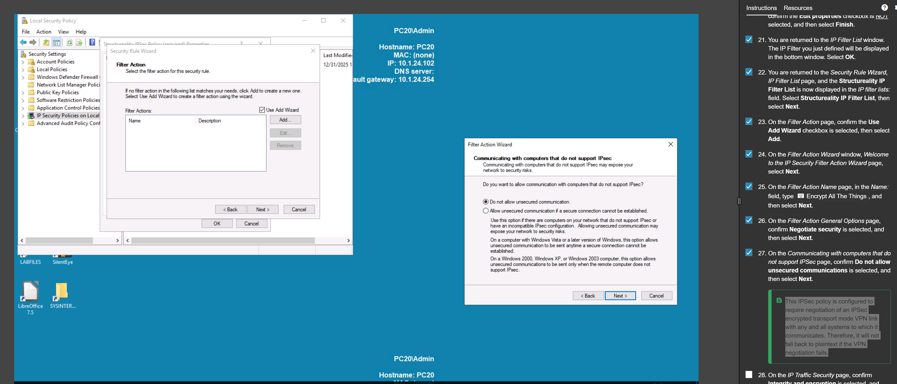

# 1. Remote Access
- This is because a **new user profile and home directory are being created** for the Rene account. This is the first time this account has been used to sign into this computer.
- PuTTY is a free and open-source terminal emulator, serial console, and network file transfer application. It is primarily used to establish remote connections to other devices, such as servers, routers, switches, and more, using various network protocols, including SSH (Secure Shell), Telnet, and serial connections.
- Putty [Terminal Emulator, Network File Transfer, **Serial Console**]

```shell
apt install openssh-server
```

# 2. Ipsec Tunneling
- [IPSec, TLS, SSH]
- In most real-world situations, you do not want to allow fallback to unsecured connections in an IPSec policy. Instead, you would want to define an IPSec policy for those IP addresses that you want to enforce and require IPSec encryption so that you can use non-IPSec encrypted communications on other IP addresses (such as when communicating with an internet site).

- An IPSec Policy** must be defined on each system** that needs to support or require IPSec encrypted connections. There are three primary security methods for an IPSec policy: **permit, block, and negotiat**e security. The permit option will negotiate encryption if another system asks for it. The block option prevents IPSec negotiations.

The negotiate security option will always request encryption. In addition, there are sub-options, including Accept unsecured communication, but always respond using IPsec and Allow fallback to unsecured communications if a secure connection can not be established. Therefore, it is important to fully understand your communication encryption needs and intentions, map out the IPSec configuration you intend to deploy on your network, and then only after thorough planning should you attempt to implement the designed and planned IPSec configuration.

{
    ### What does "Fallback" actually mean?

    In IPsec, this is often called **"Request Security"** or **"Opportunistic Encryption."** It works like a polite negotiation:

    1. **The Greeting:** Machine A (Updated) sends a packet to Machine B. It includes an "IPsec proposal" (basically saying, *"Hey, can we talk securely?"*).
    2. **The Decision:**
    * **If Machine B is updated:** It says *"Yes!"* and they build a secure tunnel. **(Secure)**
    * **If Machine B is NOT updated:** It doesn't understand the proposal and ignores it. Machine A waits a few milliseconds, sees no response, and says, *"Okay, I guess you're old school. Let's just talk normally."* **(Unsecure Fallback)**
}

- This traffic was enclosed in an IPSec tunnel. The contents of an IPSec tunnel **cannot be evaluated by Wireshark** due to the encryption occurring at the network layer (i.e, OSI layer 3).

- The displayed packets of **ISAKMP (Internet Security Association Key Management Protocol)** all relate to the encryption negotiation of IPSec. The discovery of ISAKMP communications on the network confirms that IPSec negotiations are taking place.
- **ESP** is the primary encryption container for IPSec tunnels. The presence of ESP packets confirms IPSec tunnels were established and encrypted communications are taking place.





```
icmp and icmp.type!=3
```